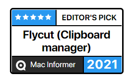

# Flycut

 
**Description:**
Flycut is a clean and simple clipboard manager for developers. It's based on an open source app called Jumpcut.

On the Mac, every time you copy a code piece, Flycut stores it in history. Later, you can paste it using Shift-Command-V even if you have something different in your current clipboard. You can change the hotkey and other settings in preferences.

On iOS, every time you open Flycut, it checks for a new clipping and stores it in history. Later, you can tap any item in the history list to place it on the clipboard. You can also swipe web links in the history to open them without placing them on the clipboard.

Developed by developers for developers.

**Donation:**
If you like Flycut, you can donate [here](https://paypal.me/flycut)

## Install

***For OSX 10.13 and older use DRM-Free version***

***For OSX 10.14 and later use either App Store or DRM-Free versions. But don't fortget to give Flycut access in System Preferences -> Security & Privacy -> Privacy -> Accessibility. If you had previous version of Flycut installed, you might need to remove if from Accessibility first and add it again.***

**Mac App Store:**
Download from the App Store [here](http://itunes.apple.com/us/app/flycut-clipboard-manager/id442160987?mt=12)

**DRM-Free:**
Download latest DRM-Free version [here](https://github.com/TermiT/Flycut/releases)

**iOS App Store:**
Download from the App Store [here](https://itunes.apple.com/us/app/flycut/id1273639655?mt=8)

## Use
**Documentation:**
[Mac Help File](help.md) / [iOS Help File](help.iOS.md)

## Develop
**Contributors:**
Check the list of contributors [here](https://github.com/TermiT/Flycut/graphs/contributors)

**License:**
MIT
